<!-- HTML comments never render. Useful for notes to editors. -->

<div align="center">

<picture>
  <source media="(prefers-color-scheme: dark)" srcset="https://placehold.co/600x120/0d1117/58a6ff?text=Dark+Mode+Banner">
  <source media="(prefers-color-scheme: light)" srcset="https://placehold.co/600x120/ffffff/0969da?text=Light+Mode+Banner">
  
</picture>

# GitHub Markdown Capabilities Demo

<p>
  
  
  
  
</p>

**[Text](#1-text) · [Alerts](#2-alerts) · [Tables](#3-tables) · [Diagrams](#6-diagrams) · [Math](#7-math) · [Maps & 3D](#8-maps-and-3d)**

</div>

---

## 1. Text

**Bold**, *italic*, ***bold italic***, ~~strikethrough~~, `inline code`, <ins>underline</ins>, <del>deleted</del>, <mark>highlight</mark>, <small>small text</small>

H<sub>2</sub>O · E = mc<sup>2</sup> · <kbd>Ctrl</kbd> + <kbd>Shift</kbd> + <kbd>P</kbd> · <samp>sample output</samp> · <var>variable</var> · <abbr title="Long Range">LoRa</abbr> (hover it) · <q>inline quote</q> · <cite>A Citation</cite> · <dfn>definition term</dfn>

<ruby>漢<rp>(</rp><rt>kan</rt><rp>)</rp>字<rp>(</rp><rt>ji</rt><rp>)</rp></ruby> ruby annotations · <bdo dir="rtl">reversed text</bdo> · Super&shy;cali&shy;fragilistic soft hyphens

Line one with two trailing spaces  
Line two · Line three via tag<br>Line four

Emoji shortcodes :rocket: :satellite: :battery: :zap: :white_check_mark: :warning: and plain 📡

Autolinks: https://github.com · <https://example.com> · user@example.com · mentions like @octocat and issue refs like #1 render as links in repos

Escapes: \*not italic\* \# not a heading \| not a pipe

Footnotes work too.[^1] Named ones as well.[^note]

[^1]: This footnote appears at the bottom with a back-link.
[^note]: Footnotes can hold **formatting** and `code`.

###### Heading level 6 is the smallest

---

## 2. Alerts

> [!NOTE]
> Useful information users should know.

> [!TIP]
> Helpful advice for doing things better.

> [!IMPORTANT]
> Key information users need to know.

> [!WARNING]
> Urgent info that needs immediate attention.

> [!CAUTION]
> Advises about risks or negative outcomes.

> Plain blockquote
>> Nested blockquote
>>> Nested again, with **formatting** and a list:
>>> - one
>>> - two

---

## 3. Tables

### Markdown table with alignment

| Left | Center | Right | Inline formatting |
| :--- | :----: | ----: | --- |
| `heltec_v4` | ✅ | 3600 mV | **bold** and ~~strike~~ |
| `xiao_c3` | ⚠️ | 3300 mV | [link](#1-text) and <kbd>key</kbd> |
| escaped \| pipe | ❌ | 0 mV | line<br>break inside a cell |

### HTML table with spans, caption, header groups

<table>
  <caption><b>Board capability matrix</b></caption>
  <thead>
    <tr>
      <th rowspan="2">Board</th>
      <th colspan="2">Roles</th>
      <th rowspan="2">Status</th>
    </tr>
    <tr>
      <th>Repeater</th>
      <th>Room</th>
    </tr>
  </thead>
  <tbody>
    <tr>
      <td>Heltec V4</td>
      <td align="center">✅</td>
      <td align="center">✅</td>
      <td rowspan="2" align="center"></td>
    </tr>
    <tr>
      <td>Xiao C3</td>
      <td align="center">✅</td>
      <td align="center">✅</td>
    </tr>
  </tbody>
  <tfoot>
    <tr><td colspan="4" align="right"><sub>Footer row spanning all columns</sub></td></tr>
  </tfoot>
</table>

### Side-by-side layout (tables as columns)

<table>
<tr>
<td width="50%" valign="top">

**Left column** — full Markdown works inside when blank lines surround it.

```bash
pio run -e heltec_v4_repeater
```

</td>
<td width="50%" valign="top">

**Right column**

- [x] done
- [ ] pending

</td>
</tr>
</table>

---

## 4. Lists

1. Ordered
   1. Nested ordered
      - Mixed nested bullet
        - Deeper
2. Second
   > Blockquote inside a list

   ```c
   // code inside a list
   ```
3. Third

<ol start="7" type="i">
  <li>HTML list starting at vii</li>
  <li>Roman numerals</li>
</ol>

- [x] Task list item, checked
- [ ] Unchecked item
  - [ ] Nested task

<dl>
  <dt>Definition list term</dt>
  <dd>Its description, indented.</dd>
  <dt>Second term</dt>
  <dd>Another description.</dd>
</dl>

---

## 5. Code

```cpp
// Syntax highlighting by language tag
static bool matches(const uint8_t* a, const uint8_t* b) {
  return memcmp(a, b, 32) == 0;
}
```

```diff
- set ota.fw.sha256 <hex>
+ start ota wan update
! changed line (some themes)
```

```yaml
targets:
  - board: heltec_v4
    mods: [power-guard, sync-settings]
```

```json
{ "board": "heltec_v4", "mv": 3600, "ok": true }
```

````markdown
```nested
Use four backticks to show a fence inside a fence.
```
````

<pre>
Raw preformatted block with <b>HTML bold</b> inside.
</pre>

---

## 6. Diagrams

<details open>
<summary><b>Flowchart</b></summary>

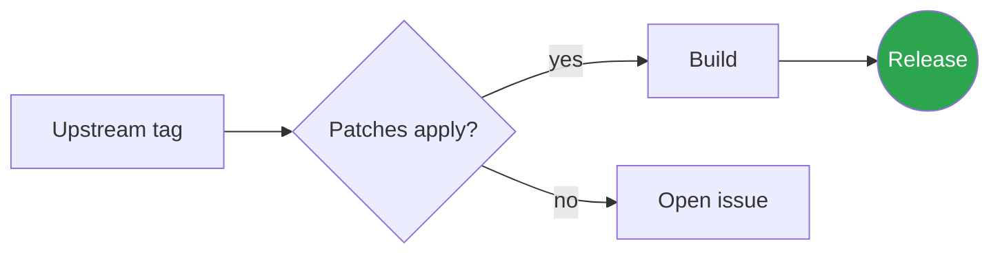

</details>

<details>
<summary><b>Sequence diagram</b></summary>

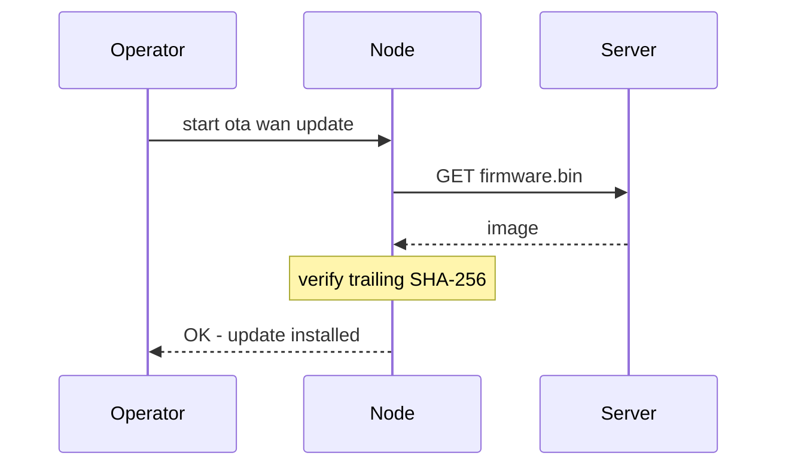

</details>

<details>
<summary><b>Gantt, pie, state, class, ER, git graph, mindmap, timeline, quadrant, xy chart</b></summary>

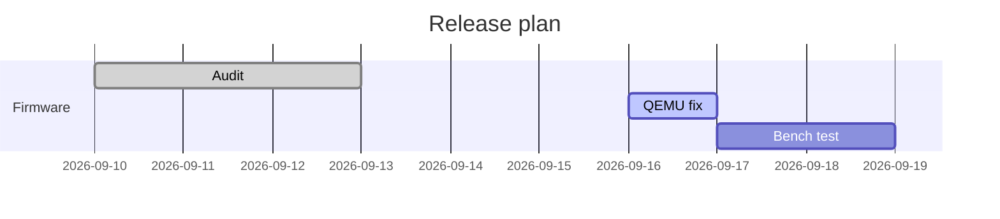

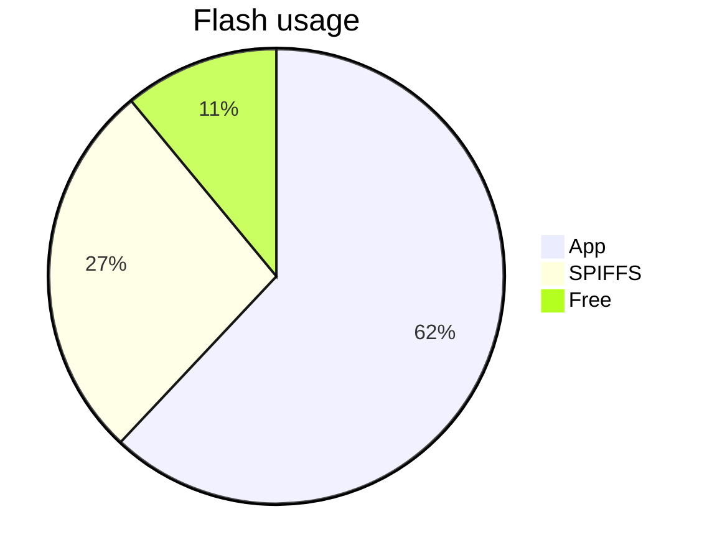

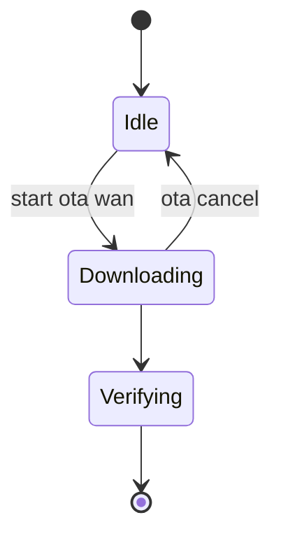

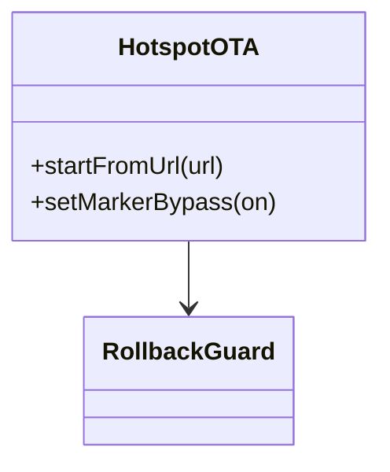

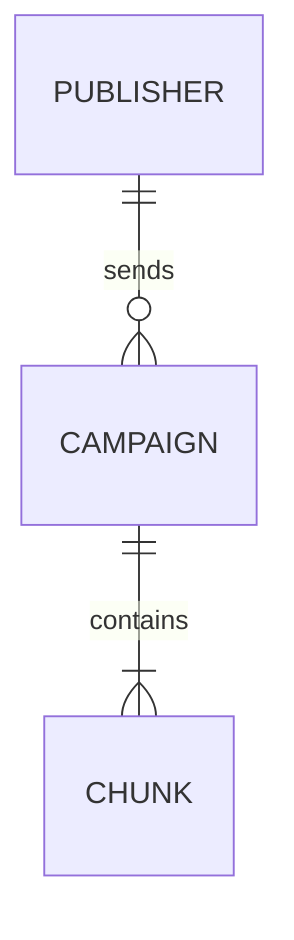

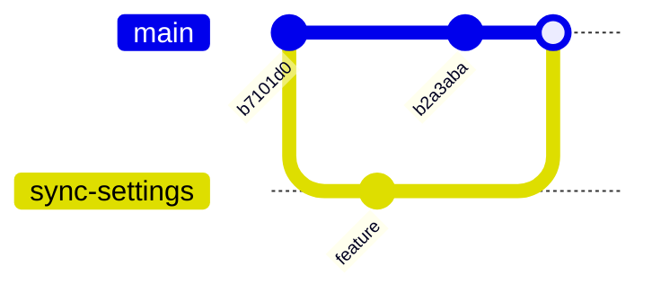

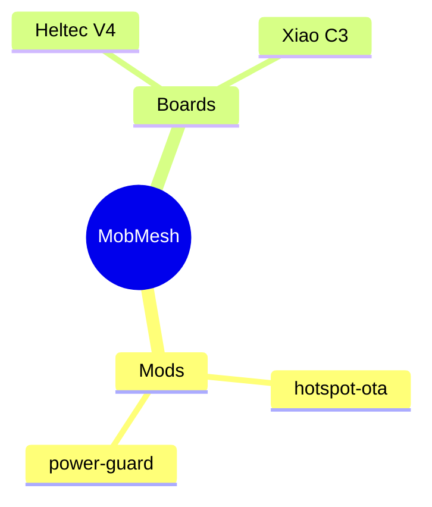

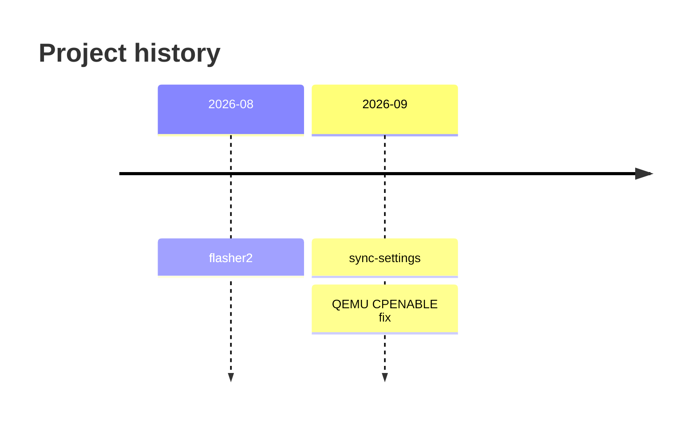

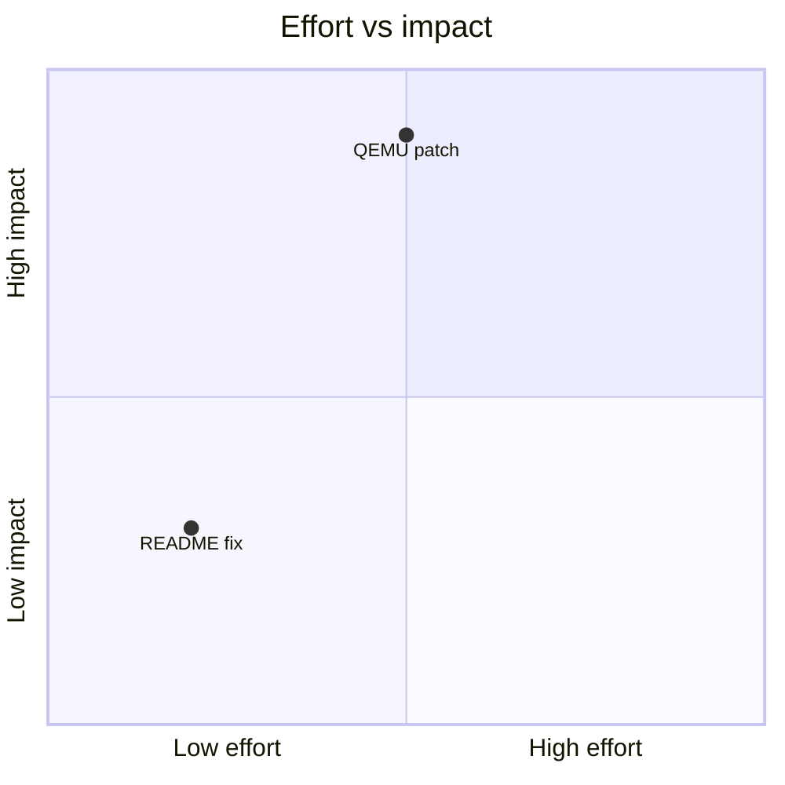

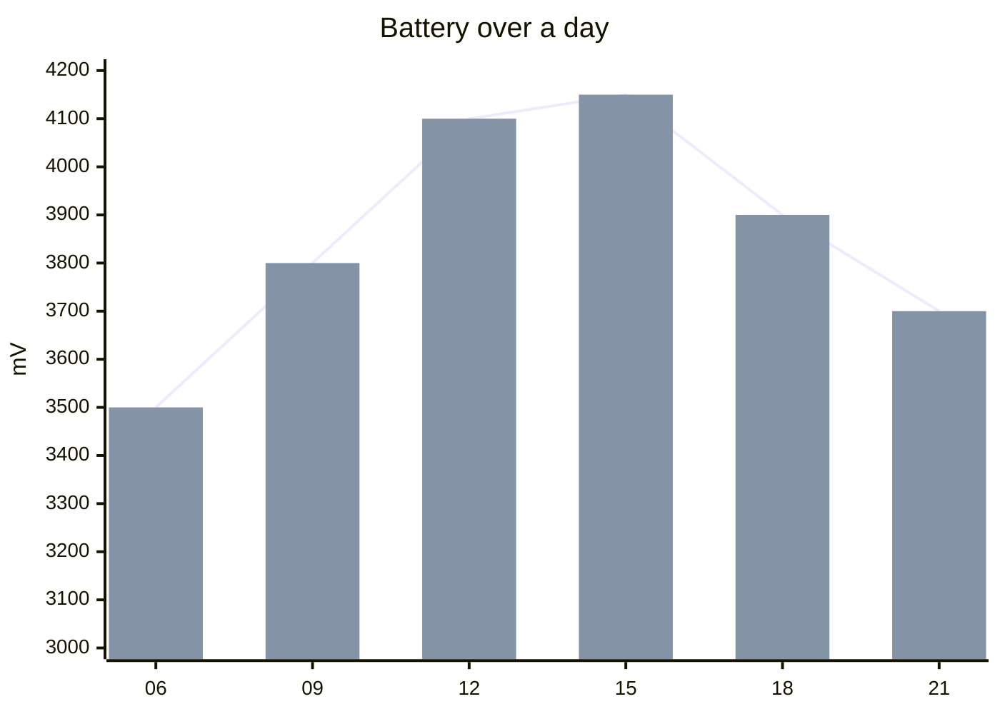

</details>

---

## 7. Math

Inline math: $E = mc^2$ and $\sqrt{a^2 + b^2}$, or with backtick delimiters $`\frac{1}{n}`$.

$$
\text{SNR}_{dB} = 10 \log_{10}\left(\frac{P_{signal}}{P_{noise}}\right)
$$

```math
\begin{bmatrix} a & b \\ c & d \end{bmatrix}
\cdot
\sum_{i=0}^{n} x_i^2
```

---

## 8. Maps and 3D

```geojson
{
  "type": "FeatureCollection",
  "features": [
    { "type": "Feature", "properties": { "name": "Mobile, AL" },
      "geometry": { "type": "Point", "coordinates": [-88.0399, 30.6954] } },
    { "type": "Feature", "properties": { "name": "Coverage" },
      "geometry": { "type": "Polygon", "coordinates": [[[-88.3,30.5],[-87.8,30.5],[-87.8,30.9],[-88.3,30.9],[-88.3,30.5]]] } }
  ]
}
```

```stl
solid cube
  facet normal 0 0 -1
    outer loop
      vertex 0 0 0
      vertex 1 1 0
      vertex 1 0 0
    endloop
  endfacet
  facet normal 0 0 -1
    outer loop
      vertex 0 0 0
      vertex 0 1 0
      vertex 1 1 0
    endloop
  endfacet
  facet normal 0 -1 0
    outer loop
      vertex 0 0 0
      vertex 1 0 0
      vertex 0.5 0.5 1
    endloop
  endfacet
  facet normal 1 0 0
    outer loop
      vertex 1 0 0
      vertex 1 1 0
      vertex 0.5 0.5 1
    endloop
  endfacet
  facet normal 0 1 0
    outer loop
      vertex 1 1 0
      vertex 0 1 0
      vertex 0.5 0.5 1
    endloop
  endfacet
  facet normal -1 0 0
    outer loop
      vertex 0 1 0
      vertex 0 0 0
      vertex 0.5 0.5 1
    endloop
  endfacet
endsolid cube
```

---

## 9. Media and layout

<p align="center">
  
  &nbsp;
  
  &nbsp;
  
</p>

<figure>
  
  <figcaption><i>Figure with caption</i></figcaption>
</figure>


Text wraps beside an image floated with `align="right"`. This is the only float GitHub allows, since `style` attributes are stripped. Keep writing so the wrap is visible across several lines of text in a normal-width README view.

<br clear="right">

[](#top)

Reference-style link: [MeshCore][mc] and a reference image: ![tiny][dot]

[mc]: https://github.com/meshcore-dev/MeshCore "Tooltip on hover"
[dot]: https://placehold.co/16x16/2da44e/2da44e.png

---

## 10. Vectors and inline images

### SVG files, including CSS animation and dark-mode media queries


Also works as plain Markdown: 

### Inline images sitting in a line of text

Status  node  MOB-BENCH1 is repeating  on 910.525 MHz.

### Theme-specific images without `<picture>`


### Animated GIF


---

## 11. Collapsible sections

<details>
<summary>Click to expand</summary>

Hidden content with **Markdown**, tables and code:

| a | b |
|---|---|
| 1 | 2 |

<details>
<summary>Nested collapsible</summary>

Deeper still.

</details>
</details>

---

<div align="right"><sub>Back to <a href="#github-markdown-capabilities-demo">top ↑</a></sub></div>

<!--
Not supported in files (stripped or ignored):
  style="", class="", <script>, <iframe>, <font color>, custom CSS, JS
  inline <svg> markup and data: URIs in img src (use an .svg file instead)
  scripts and external references inside SVG files (the SVG's own <style> is kept)
Works only in issues/PR comments, not files:
  color chips like `#0969DA` / `rgb(9, 105, 218)`
-->
