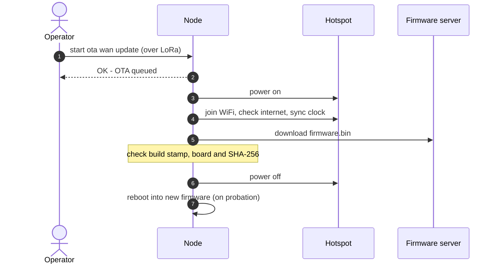
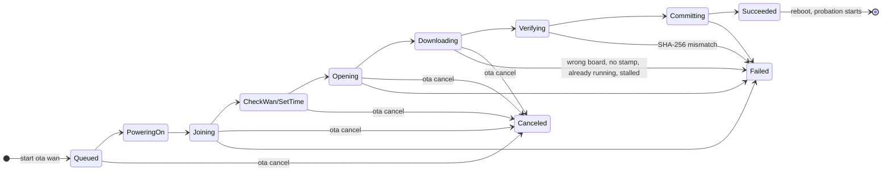
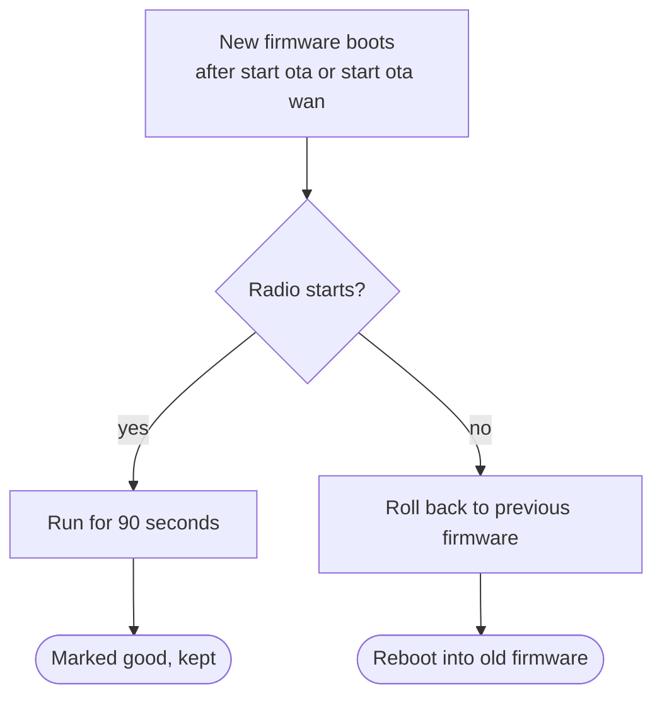

# hotspot-ota - Truely Remote OTA Firmware Updates

Remote nodes are hard to reach, and a bad update can leave one deaf to the mesh. This mod
fixes both halves of that:

- **Update from anywhere.** Send a command over LoRa. The node powers up its hotspot, joins
  WiFi, downloads the new firmware, checks it, and installs it. No site visit.
- **A bad update can't strand it.** New firmware has to prove itself before it's kept. If
  the radio won't start, the node rolls back to what it was running before.



MeshCore's own local `start ota` still works too, with a long list of fixes. See
[Local Access Point - Start OTA](#5-local-access-point---start-ota).

---

## 1. Hardware Requirements

Only the hotspot power control needs extra hardware: a switch on a GPIO pin that powers a
WiFi hotspot or cell modem. The node turns it on for an update and off again afterwards, so
the hotspot only draws power while it's needed.

That matters on a solar or battery node. A cellular hotspot left plugged in quietly drains the
pack all day, even when nobody is using it. With its power rail switched off, the hotspot has
**zero idle (vampire) draw** between updates. The only thing left on is the switch itself,
which leaks a few microamps at most.

> [!TIP]
> **No hotspot needed if WiFi is already in range.** If the node can reach an existing WiFi
> network, just save it with `set ota.wan.wifi` and the node joins it directly for updates. The
> power switch and hotspot are only for sites with no WiFi of their own.

> [!IMPORTANT]
> The pin is **held high for the whole update**, not pulsed. If you use a load-switch IC, its
> enable line has to stay asserted the entire time. Add a pulldown on that line so the rail
> defaults to off after any reset.

The right GPIO depends on the board. See `variants/<board>/README.md` for the confirmed pin
and wiring notes. Rollback protection and clock sync need no extra hardware.

---

## 2. CLI Commands

All of these work over serial or remotely over the mesh, alongside MeshCore's own commands.
Full details are in [`docs/cli-additions.md`](docs/cli-additions.md).

<table>
<thead><tr><th align="left">Command</th><th align="left">What it does</th></tr></thead>
<tbody>
<tr><th colspan="2" align="left">⚙️ Setup</th></tr>
<tr><td><code>set ota.wan.wifi &lt;ssid&gt;,&lt;password&gt;</code></td><td>Save the WiFi network to use. Survives firmware updates.</td></tr>
<tr><td><code>set ota.fw.url &lt;url&gt;</code></td><td>Save a default firmware URL. Can be overwritten, not cleared.</td></tr>
<tr><th colspan="2" align="left">⬇️ Updating</th></tr>
<tr><td><code>start ota wan &lt;url&gt;</code></td><td>Join WiFi, download from <code>&lt;url&gt;</code>, check it, and install it.</td></tr>
<tr><td><code>start ota wan update</code></td><td>Same, using the saved <code>ota.fw.url</code>.</td></tr>
<tr><td><code>get ota.status</code></td><td>Current step, download progress, or the final result.</td></tr>
<tr><td><code>ota cancel</code></td><td>Stop an update any time before it starts verifying.</td></tr>
<tr><td><code>set ota.fw.marker &lt;on|off&gt;</code></td><td>Turn the build-stamp check off for the next update only. ⚠️ See the note below.</td></tr>
<tr><th colspan="2" align="left">📶 WAN diagnostics</th></tr>
<tr><td><code>ota wan join</code></td><td>Join WiFi without downloading.</td></tr>
<tr><td><code>ota wan leave</code></td><td>Disconnect and cut hotspot power.</td></tr>
<tr><td><code>ota wan check</code></td><td>Check the node can reach the internet.</td></tr>
<tr><td><code>get ota.wan.pwr</code></td><td>Read the hotspot power switch.</td></tr>
<tr><td><code>set ota.wan.pwr &lt;on|off&gt;</code></td><td>Switch the hotspot power directly.</td></tr>
<tr><th colspan="2" align="left">🔀 Slots</th></tr>
<tr><td><code>get ota.slot</code></td><td>Version and state of both slots.</td></tr>
<tr><td><code>ota slot boot &lt;A|B&gt;</code></td><td>Boot the other slot. Refused if it's already active or holds no valid image.</td></tr>
</tbody>
</table>

> [!IMPORTANT]
> `set ota.fw.marker off` lets the next update install firmware that isn't from this
> project, including stock MeshCore. That firmware has no `start ota wan`, so the node can't be
> updated remotely again until someone flashes it by hand. The SHA-256 check still runs.

### Example

```text
set ota.wan.wifi MyHotspot,hunter2
start ota wan https://example.com/firmware/heltec_v4_repeater-v1.16.0.bin
```

Every image carries its own SHA-256 in its last 32 bytes, so the node only ever downloads the
one file.

---

## 3. Short Commands for Remote Updates

> [!TIP]
> Every character counts over LoRa. Save the URL once, then every future update is just
> `start ota wan update`.

```text
set ota.fw.url https://tools.mobmesh.org/flasher/heltec_v4/repeater/firmware.bin
start ota wan update
```

---

## 4. How an Update Runs

`start ota wan` replies `OK - OTA queued` right away. The update then runs in the background,
so the node keeps repeating and answering commands. The whole thing takes up to about two
minutes.



On failure or cancel, the current firmware keeps running and `get ota.status` keeps the
result so you can see what happened.

### What Is Known in 288 Bytes (<1 KB)

> [!TIP]
> To conserve data costs, hotspot-ota decides instantly if a download should continue.

Every MobMesh build carries a small identity block near the very start of the file. The node
reads it as soon as the first chunk arrives (the block ends 288 bytes in), and drops the
connection straight away if the image is:

| Problem | Reply |
| --- | --- |
| Not a MobMesh build | `no H0TSP0T metadata -- not a build of this project` |
| A build without hotspot-ota | `image has no OTA support` |
| For a different board or role | `image is for X, this node is Y` |
| The firmware already running | `already running vX (sha) -- nothing to do` |

A good image downloads in full and is then checked against its SHA-256.

---

## 5. Local Access Point - Start OTA

MeshCore's own `start ota` turns the node into a WiFi access point so someone standing nearby
can upload firmware from a phone or laptop. This mod doesn't just add the remote path: it also
replaces the stock `start ota` with a tighter version, so a lot of fixes and improvements come
along for the ride.

### New commands

| Command | What it does | Why it matters |
| --- | --- | --- |
| `stop ota` | Shuts down the access point and its web server. Refused while an upload is writing. | Stock has no off switch. Once started, the access point stays up until the node reboots. |
| `get ota.ap` | Shows whether the access point is up, how long it has left, and whether an upload is running. | You can check on a session remotely instead of guessing. |

### Enhanced safety

**It doesn't stay up forever.** Stock `start ota` leaves the access point and web server running
until a reboot. That wastes power on a solar or battery node, and leaves an open, password-free
upload page sitting there for anyone in range.

- Closes by itself 20 minutes after `start ota`, or 10 minutes after an upload stops making progress.
- `stop ota` closes it on demand.

**It won't start at a bad moment.** `start ota` is refused while:

- new firmware is still on probation (it tells you how many seconds are left)
- the rollback state can't be read
- a remote update is already running
- an access point session is already up

**It protects the upload while it's running.**

- `reboot`, `poweroff`, `shutdown` and `erase` are refused while an upload is writing, so a slot is never left half-written.
- Power saving is held off while the access point is up.
- Remote updates are refused while the access point is up, since both use the same flash writer.

<details>
<summary>📂 <b>Safer uploads</b> <sub>(click to expand)</sub></summary>

| Stock Meshcore | Our Firmware |
| --- | --- |
| Sets the expected MD5 *before* starting the update, which silently clears it, so the MD5 is never checked. | Sets it after, so the MD5 the page sends is actually checked. |
| A second upload can collide with the first. | One upload at a time. A second is refused without touching the first. |
| A rejected upload can still look like a success. | Every failure returns a real error message. |
| Reboots inside the upload handler, so the browser never hears back. | Replies first, reboots 1.5 seconds later, so the page shows "Update complete". |
| A stalled upload leaves the flash writer locked. | A stalled upload is cleared and the writer released. |
| New firmware is trusted immediately. | New firmware goes on probation, with automatic rollback. |

</details>

### A better upload page

The stock form is replaced with an enhanced one. It shows the node's name, ID,
chip, battery voltage, both slots, and whether the running firmware is on probation. It can also
set the node's clock from your phone, and can send a zero-hop advert (at most once every 10 seconds).

Most importantly, it **checks the firmware file before sending anything**.

<details>
<summary>📂 <b>Firmware file checks</b> <sub>(click to expand)</sub></summary>

| Check | Result | Can you override it? |
| --- | --- | --- |
| File can't be read | Blocked | No |
| Too small to be firmware | Blocked | No |
| Full-flash image (bootloader and partitions) | Blocked: flash it over USB instead | No |
| Built for a different chip | Blocked: "Built for X, this node is Y" | No |
| Bigger than the target slot | Blocked, showing how far over | No |
| Header is malformed | Blocked | No |
| Node details unavailable | Warning: can't check against this node | Yes |
| No MobMesh stamp, or no hotspot OTA built in | Warning: would remove remote updates | Yes |
| Built for a different board or role | Warning: "Image is for X, this node is Y" | Yes |
| Same version as the running firmware | Warning: nothing to do | Yes |
| Everything checks out | "Verified vX (sha) for board/role" | - |

- Warnings need **I know what I'm doing** ticked before **Install firmware** unlocks.
- The page works out the file's MD5 in the browser and sends it with the upload.
- Picking a different file mid-check throws the old results away, so they can never approve the new file.
- Dropped files get the same checks as picked ones.

</details>

---

## 6. Automatic Rollback Protection

Stock MeshCore calls `halt()` when the radio won't start, and the node stays dead until
someone visits. This mod gives new firmware a trial period instead:



- **Works after either update path:** local `start ota` or remote `start ota wan`.
- **No extra hardware.** It uses ESP-IDF's built-in app rollback.
- **No accidental rollback.** `poweroff` is refused during probation, since sleeping then
  would roll back a good update.
- **No reboot loops.** A radio failure with no recent update gets a few quick retries, then the
  node deep-sleeps and tries again on each wake, backing off to once every 15 minutes.

---

## 7. Automatic Clock Sync

These boards have no battery-backed clock, so every reboot resets the time to a placeholder
date (the [`timing-safety`](../timing-safety) mod explains what that affects).

Whenever the node joins WiFi for OTA (`ota wan join`, `start ota wan` or
`start ota wan update`), it also sets its clock from `us.pool.ntp.org`, falling back to
`pool.ntp.org`. No extra command, and no extra connection.

> [!NOTE]
> This always happens and can't be turned off. If the time server doesn't answer, the clock
> is left alone and the update carries on.
